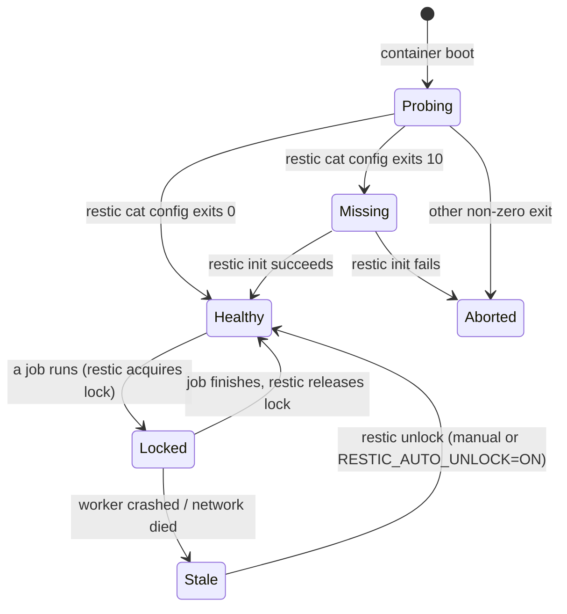

# Architecture

A bird's-eye view of how the container is wired together. Read this before
changing config — it explains *why* the env var names look the way they do,
why each worker has its own lock file, and how Restic / Rclone hook into
the rest of the pipeline.

## Lifecycle of a container

```mermaid
flowchart TD
    subgraph Boot["Container startup"]
        A[/entry.sh/] --> B{NFS_TARGET set?}
        B -- yes --> B1[mount /mnt/restic]
        B -- no  --> C
        B1 --> C[Print release metadata]
        C --> D{RESTIC_CHECK_REPOSITORY_STATUS=ON?}
        D -- no --> F
        D -- yes --> E[restic cat config]
        E -->|exit 0| F
        E -->|exit 10| E10[restic init]
        E -->|other| EX[Abort: log stderr]
        E10 --> F[Write /var/spool/cron/crontabs/root]
        F --> G[exec crond -f]
    end
    G --> H[crond fires]
    H --> I[/bin/locked_run job /bin/job/]
    I --> J{flock acquired?}
    J -- no --> S[Log skip line; exit 0]
    J -- yes --> K[/bin/job runs]
    K --> L[(/var/log/last-job.json)]
    K --> M[(restic_job.prom)]
    K --> N{MAILX_RCPT?}
    K --> O{WEBHOOK_URL?}
    N -- yes --> N1[mail via msmtp]
    O -- yes --> O1[POST JSON to webhook]
    K --> P{post-job hook?}
    P -- yes --> P1[/hooks/post-job.sh $rc]
```

The entrypoint is **`/entry.sh`**. On container boot it:

1. Optionally mounts an NFS export (`NFS_TARGET`) and aborts on failure
   so jobs never run against an empty `/mnt/restic`.
2. Prints the release metadata baked in via `RESTIC_BACKUP_HELPER_RELEASE`.
3. Probes the repository with `restic cat config` (when
   `RESTIC_CHECK_REPOSITORY_STATUS=ON`). Auto-`restic init` runs **only**
   on exit code `10` (repo missing). Any other non-zero exit logs restic
   stderr and aborts startup — that prevents transient TLS/network/auth
   failures from silently re-initialising a healthy remote.
4. Writes the rendered crontab to `/var/spool/cron/crontabs/root`.
5. Execs `crond -f` so the container's PID 1 is the cron daemon.

The default `CMD` is `tail -fn0 /var/log/cron.log` so the container stays
foreground-friendly for Compose / Kubernetes log scrapers.

## Worker scripts

Each scheduled job lives in its own script under `/bin/`, sourced from the
repo's `app/` directory at image build time:

| Script | Source | When | Purpose |
| --- | --- | --- | --- |
| `/bin/backup` | `app/backup.sh` | `BACKUP_CRON` (always) | `restic backup` + optional `restic forget`. |
| `/bin/check` | `app/check.sh` | `CHECK_CRON` (optional) | `restic check`. |
| `/bin/prune` | `app/prune.sh` | `PRUNE_CRON` (optional) | Standalone `restic prune`. |
| `/bin/replicate` | `app/replicate.sh` | `REPLICATE_CRON` (optional) | Rclone `bisync`/`sync`/`copy` per job file. |
| `/bin/rotate_log` | `app/rotate_log.sh` | `ROTATE_LOG_CRON` (always) | Compress oversized `cron.log`. |
| `/bin/restore` | `app/restore.sh` | Operator-driven | Wrapper around `restic restore`. |
| `/bin/snapshot-export` | `app/snapshot_export.sh` | Operator-driven | `restic restore` + `tar.gz` archive. |
| `/bin/forget-preview` | `app/forget_preview.sh` | Operator-driven | `restic forget --dry-run` retention preview. |
| `/bin/mount-snapshot` | `app/mount_snapshot.sh` | Operator-driven | `restic mount` (FUSE) with safe target validation and clean unmount. |
| `/bin/doctor` | `app/doctor.sh` | Operator-driven | Read-only diagnostics. |
| `/bin/locked_run` | `app/locked_run.sh` | Wraps every cron entry | Per-job `flock`; logs skips. |

## Locked execution

Every cron entry is wrapped in `/bin/locked_run <name>` which acquires
`/var/run/<name>.lock` via `flock -n`. If a previous tick is still running
the new invocation immediately logs

```text
⏭ <name> skipped: previous run still active
```

to `/var/log/cron.log` and exits `0` — overlapping ticks neither queue up
nor fail silently. Lock files are independent per worker; a long-running
`prune` never blocks a `backup` or `replicate`.

## Shared library

All workers source **`/bin/lib.sh`** (from `app/lib.sh`) for:

- **Logging primitives** — `log`, `errorlog`, `logLast` so per-run logs and
  stdout stay in sync, and `copyErrorLog` to snapshot the per-run log to a
  separate `*-error-last.log` file on failure.
- **Repository / endpoint masking** — `mask_repository`, `mask_endpoint`,
  `mask_webhook_url` strip userinfo and webhook secrets before printing.
- **Notification helpers** — `notify_mail`, `notify_webhook` so mail and
  webhook plumbing is identical across workers.
- **JSON rendering** — `render_last_run_json`, `write_last_run_json` so
  every worker emits the same schema with masked credentials.
- **Metric rendering** — `write_metrics_for_job` so the
  `restic_<job>.prom` file is consistent across workers and atomic on
  write.
- **Restic restore stat parsing** — `parse_restic_restore_stats` extracts
  the `Summary: …` line from a Restic restore log for `last-restore.json`
  and `last-snapshot-export.json`.

If you need to add a new worker, source `lib.sh` and follow the same
patterns; new workers automatically inherit the masking, logging and
notification plumbing.

## Repository state machine

The startup probe and the cron-driven workers share a small state machine:



- **Aborted** means the container exits with non-zero status from
  `/entry.sh`. Inspect the container log for restic stderr.
- **Stale** locks are intentionally *not* auto-cleared since 1.12.0.
  Multi-host repositories must not auto-unlock or you can clear another
  host's legitimate lock. Set `RESTIC_AUTO_UNLOCK=ON` to restore the
  pre-1.12 behaviour if exactly one host writes to the repo.
- The single hardcoded `restic unlock --remove-all` in `/entry.sh` runs
  only after a **failed** `restic init` — that lock can only have been
  created by the failing init attempt itself, so it is safe to clear.

## Where to read further

- [Filesystem layout](filesystem-layout.md) — every path the container
  cares about, and what to mount.
- [Cron and time zones](cron-and-time-zones.md) — `BACKUP_CRON` etc.,
  `TZ`, log line conventions.
- [Backup worker](../workers/backup.md) — step-by-step what `/bin/backup`
  actually does.
- [JSON summaries](../reference/json-summaries.md) — the schema each
  worker writes.
