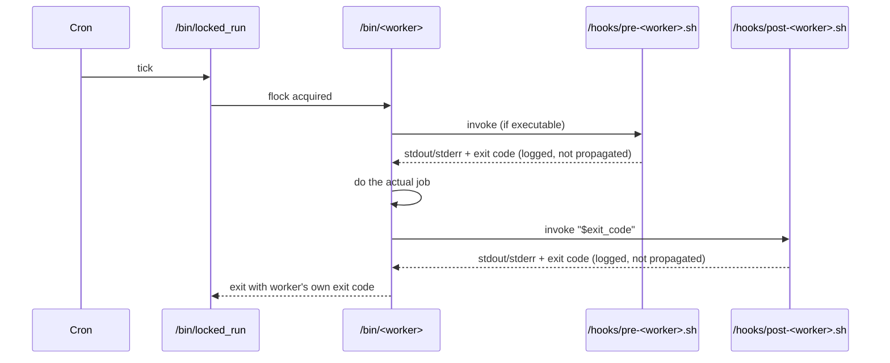

# Hooks

Hooks are operator-controlled extension points that run before and after
each worker. Mount scripts into **`/hooks`** in the container, make them
executable, and the workers will run them automatically.

## Available hooks

| Hook | Worker | First argument |
| --- | --- | --- |
| `/hooks/pre-backup.sh` | `/bin/backup` | *none* |
| `/hooks/post-backup.sh` | `/bin/backup` | Backup exit code |
| `/hooks/pre-check.sh` | `/bin/check` | *none* |
| `/hooks/post-check.sh` | `/bin/check` | Check exit code |
| `/hooks/pre-prune.sh` | `/bin/prune` | *none* |
| `/hooks/post-prune.sh` | `/bin/prune` | Prune exit code |
| `/hooks/pre-forget.sh` | `/bin/forget` (when `FORGET_CRON` is set) | *none* |
| `/hooks/post-forget.sh` | `/bin/forget` (when `FORGET_CRON` is set) | Forget exit code (`0`, `2`, `11`, …) |
| `/hooks/pre-replicate.sh` | `/bin/replicate` | *none* |
| `/hooks/post-replicate.sh` | `/bin/replicate` | Aggregate exit code |
| `/hooks/pre-restore.sh` | `/bin/restore` | *none* |
| `/hooks/post-restore.sh` | `/bin/restore` | Restore exit code |
| `/hooks/pre-snapshot-export.sh` | `/bin/snapshot-export` | *none* |
| `/hooks/post-snapshot-export.sh` | `/bin/snapshot-export` | Snapshot-export exit code |
| `/hooks/pre-forget-preview.sh` | `/bin/forget-preview` | *none* |
| `/hooks/post-forget-preview.sh` | `/bin/forget-preview` | Forget-preview exit code |
| `/hooks/pre-mount-snapshot.sh` | `/bin/mount-snapshot` | *none* |
| `/hooks/post-mount-snapshot.sh` | `/bin/mount-snapshot` | Mount-snapshot exit code (post-unmount) |
| `/hooks/pre-unlock.sh` | `/bin/unlock` | *none* |
| `/hooks/post-unlock.sh` | `/bin/unlock` | Unlock exit code |
| `/hooks/pre-sources-report.sh` | `/bin/sources-report` | *none* |
| `/hooks/post-sources-report.sh` | `/bin/sources-report` | Sources-report exit code |
| `/hooks/pre-init-repo.sh` | `/bin/init-repo` | *none* |
| `/hooks/post-init-repo.sh` | `/bin/init-repo` | Init-repo exit code |

Hooks must be **executable** inside the container (`chmod +x`). A hook
present but not executable is reported as an error in `cron.log`, not
silently skipped.

## Lifecycle



Key rules:

- **Pre-hooks do not abort the worker.** A non-zero pre-hook is logged
  prominently but the worker still runs. Use the pre-hook for *informational*
  side-effects (warming a cache, taking an upstream lock, …) — never for
  "if this fails, do not back up".
- **Post-hooks receive the worker's exit code** as `$1`. They can fan out
  to escalation channels (PagerDuty, Slack-different), unmount source
  filesystems, run an external integrity check, etc.
- **Hook output is logged but does not contribute to the worker's exit
  code.** A failed hook never turns a successful backup into a failed
  one.

## Timeouts

Set `HOOK_TIMEOUT` to a positive integer to wrap each hook in
`timeout ${HOOK_TIMEOUT}s`:

```yaml
environment:
  HOOK_TIMEOUT: "300"   # 5 minutes per hook
```

When a hook times out:

- The runner kills the hook process.
- Exit code `124` is logged as a timeout (clearly distinguished from a
  hook that exited with `124` on its own).
- Subsequent steps still run; the timeout does not propagate to the
  worker.

A `HOOK_TIMEOUT=0` (default) imposes no enforced timeout.

## Mounting hooks

=== "Docker run"

    ```shell
    docker run -d \
      -v ./hooks:/hooks:ro \
      … \
      marc0janssen/restic-backup-helper:latest
    ```

=== "Docker Compose"

    ```yaml
    volumes:
      - ./hooks:/hooks:ro
    ```

=== "Kubernetes"

    Mount a `ConfigMap` or a writable PVC at `/hooks` with the scripts in it.
    A `ConfigMap` mount renders files mode `0644` by default; use
    `defaultMode: 0o755` so the scripts are executable.

## Example hooks

### Slack notification on backup failure

```bash
#!/usr/bin/env bash
set -euo pipefail
rc="${1:-0}"
[ "${rc}" -eq 0 ] && exit 0

webhook="${SLACK_WEBHOOK_URL:-}"
[ -n "${webhook}" ] || exit 0

payload="$(jq -nc \
  --arg host "$(hostname)" \
  --arg rc   "${rc}" \
  --arg link "$(cat /var/log/last-backup.json | jq -c .)" \
  '{text: "Backup failed on \($host) with rc=\($rc)", attachments: [{text: $link}]}')"
curl -fsS -m 10 -H 'Content-Type: application/json' -d "${payload}" "${webhook}"
```

Save as `/hooks/post-backup.sh`, `chmod +x`, mount.

### Filesystem freeze around the backup

```bash
#!/usr/bin/env bash
# /hooks/pre-backup.sh
set -euo pipefail
fsfreeze --freeze /data || true
```

```bash
#!/usr/bin/env bash
# /hooks/post-backup.sh
set -euo pipefail
fsfreeze --unfreeze /data || true
exit 0
```

!!! warning "`fsfreeze` requires privileges"

    `fsfreeze` needs `CAP_SYS_ADMIN` and either a host bind mount or a
    privileged container. Consider freezing **upstream** (LVM snapshots,
    qemu-guest-agent quiesce) rather than inside this container.

### Cleanup after restore

```bash
#!/usr/bin/env bash
# /hooks/post-restore.sh — chown to the application user.
set -euo pipefail
rc="${1:-0}"
[ "${rc}" -eq 0 ] || exit 0
chown -R 1000:1000 /restore
```

This pairs with `/bin/restore --owner 1000:1000` if you prefer the flag.
The hook is useful when ownership rules depend on **which path** inside
the restore tree (different UIDs for different subdirectories).

## Inspecting hook status

`/bin/doctor` reports the presence and executable bit of every supported
hook:

```text
== Hooks ==
HOOK_TIMEOUT: 300
hooks/pre-backup.sh: executable
hooks/post-backup.sh: executable
hooks/pre-check.sh: not found
…
```

So if a hook is mounted but silently ignored, doctor tells you why.

## See also

- [Diagnostics](../operations/diagnostics.md) — what `/bin/doctor` reports.
- [Backup worker](../workers/backup.md) — hook ordering relative to
  forget / unlock.
- [Restore](../operations/restore.md) — hooks during operator-driven
  restore.
