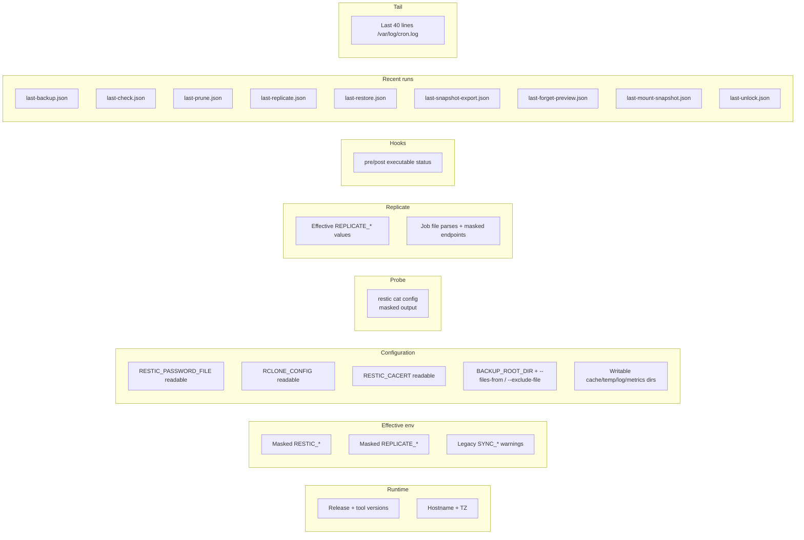

# Diagnostics (doctor and cron-list)

`/bin/doctor` is a read-only support command for "what is wrong with
this container?" moments. It does not run `restic init`, `restic
unlock`, backups, restores, replicate jobs, hooks, mail or webhooks. It
only inspects the current environment and mounted files, then exits
non-zero when it finds hard failures that would also break normal
operation.

`/bin/cron-list` is the smaller companion for "what will run and when?"
moments. It prints the container timezone, current time, the rendered
crontab and a readable schedule summary without touching the repository.

## What it reports



| Section | Information |
| --- | --- |
| **Runtime** | Release, hostname, current time, `TZ`, `restic version`, `rclone version`, `bash --version`. |
| **Effective environment** | Masked values of `RESTIC_REPOSITORY`, `REPLICATE_JOB_FILE`, mail/webhook URLs, etc. Legacy `SYNC_*` values are shown with a deprecation warning when they still override `REPLICATE_*`. |
| **Configuration checks** | `RESTIC_PASSWORD_FILE` exists and is readable; `RCLONE_CONFIG` and `RESTIC_CACERT` are readable when set; `BACKUP_ROOT_DIR` exists; `--files-from` and `--exclude-file` paths referenced from `RESTIC_JOB_ARGS` exist; cache / temp / log / metrics directories are writable. |
| **Repository probe** | Non-mutating `restic cat config`. Exit 10 is reported as "repository missing/not initialized"; doctor never initializes it. The probe output is masked before printing. |
| **Replicate** | Effective `REPLICATE_*` values and validation of `REPLICATE_JOB_FILE` rows (`SOURCE;DESTINATION[;MODE[;EXTRA_ARGS]]`) with endpoints masked. |
| **Hooks** | Each known hook path is listed with executable status (`executable`, `not executable`, `not found`). |
| **Recent JSON summaries** | The latest `last-{backup,check,prune,forget,replicate,restore,snapshot-export,forget-preview,mount-snapshot,unlock,sources-report,init-repo,notify-test}.json` content if present. |
| **Recent cron log** | Last 40 lines of `/var/log/cron.log`. |
| **Summary** | `warnings: N`, `errors: N`. Exit non-zero only on errors. |

## Quick start

```shell
docker exec -ti restic-backup-helper /bin/doctor
```

Or as a one-shot via `docker run`, without an existing container:

```shell
docker run --rm \
  --env-file restic.env \
  -v ./config:/config:ro \
  -v ./restic.password:/run/secrets/restic_password:ro \
  marc0janssen/restic-backup-helper:latest \
  doctor
```

The `doctor` entrypoint subcommand short-circuits cron startup and
exec's `/bin/doctor` directly.

For cron schedules:

```shell
docker exec -ti restic-backup-helper /bin/cron-list
docker run --rm --env-file restic.env marc0janssen/restic-backup-helper:latest cron-list
```

When the container is already running, `/bin/cron-list` prints the
actual crontab from `/var/spool/cron/crontabs/root`. In one-shot
`docker run … cron-list` mode, cron has not been rendered yet, so it
prints an environment-derived preview using the same schedule variables
as the entrypoint (`BACKUP_CRON`, `CHECK_CRON`, `REPLICATE_CRON`,
`FORGET_CRON`, `PRUNE_CRON`, `ROTATE_LOG_CRON` and legacy `SYNC_CRON`).

## Exit codes

| Exit | What it means |
| --- | --- |
| `0` | No hard errors. There may still be warnings (e.g. legacy `SYNC_*`, missing `MAILX_RCPT` when you expected mail). |
| `1` | At least one hard error. Examples: missing repository settings, unreadable required secrets / config, empty `RESTIC_TAG`, no backup paths, failed repository probe. |

## Machine-readable output (`--json`)

Both `/bin/doctor` and `config-check` accept `--json` (alias `-j`) and
emit a single JSON document on **stdout** in addition to the usual
text mode. The exit code is identical: `0` when no errors were
recorded, `1` otherwise. The text-mode banners/error lines are
suppressed in JSON mode so consumers see only the JSON envelope.

This is the same JSON philosophy as the per-worker `last-*.json` files
and the `restic_*.prom` textfile collector — CI / Kubernetes / external
monitoring should not have to regex-parse text lines.

```shell
docker exec restic-backup-helper doctor --json | jq '.checks[] | select(.status=="fail")'
docker exec restic-backup-helper config-check --json | jq -r '.errors, .warnings'

# As a one-shot in CI / preflight init container:
docker run --rm --env-file restic.env \
  -v ./config:/config:ro \
  -v ./restic.password:/run/secrets/restic_password:ro \
  marc0janssen/restic-backup-helper:latest \
  config-check --json
```

### `config-check --json`

Schema `restic-backup-helper.config-check/1`. Lean by design — it is
intended for init-container readiness probes and CI gates.

| Field | Type | Description |
| --- | --- | --- |
| `schema` | string | Constant `restic-backup-helper.config-check/1`. |
| `command` | string | Constant `config-check`. |
| `release` | string | `${VERSION}-${restic_base}` baked at build time. |
| `hostname` | string | Container hostname. |
| `generated_at` | string | ISO 8601 in container `TZ`. |
| `generated_epoch` | integer | Unix epoch seconds. |
| `warnings` | integer | Number of `warn` findings. |
| `errors` | integer | Number of `fail` findings (matches `exit_code`). |
| `exit_code` | integer | `0` on success, `1` when at least one `fail`. |
| `checks` | array of `{key, status, message}` | One entry per validation. `status` ∈ `ok`, `warn`, `fail`. `key` is a stable identifier (e.g. `RESTIC_REPOSITORY`, `RESTIC_PASSWORD`, `BACKUP_PATHS`). |

```json
{
  "schema": "restic-backup-helper.config-check/1",
  "command": "config-check",
  "release": "2.12.0-0.18.1",
  "hostname": "backup-node",
  "generated_at": "2026-05-13T22:07:08+0200",
  "generated_epoch": 1747166828,
  "warnings": 0,
  "errors": 0,
  "exit_code": 0,
  "checks": [
    {"key": "RESTIC_REPOSITORY", "status": "ok", "message": "RESTIC_REPOSITORY is set to rclone:jottacloud:backups."},
    {"key": "RESTIC_PASSWORD", "status": "ok", "message": "RESTIC_PASSWORD_FILE is readable."},
    {"key": "RESTIC_TAG", "status": "ok", "message": "RESTIC_TAG is set (backup-node)."},
    {"key": "BACKUP_PATHS", "status": "ok", "message": "Backup paths are configured."}
  ]
}
```

### `doctor --json`

Schema `restic-backup-helper.doctor/1`. Same envelope as
`config-check` plus six typed sections so dashboards can pin specific
fields without re-deriving them from the flat `checks[]` array. Every
text-mode finding (`[OK] / [INFO] / [WARN] / [FAIL]`) appears in
`checks[]` tagged with the section it was emitted under, so existing
text consumers and the JSON consumer always see the same set of
findings.

| Field | Type | Description |
| --- | --- | --- |
| `schema` | string | Constant `restic-backup-helper.doctor/1`. |
| `command` | string | Constant `doctor`. |
| Common envelope | – | `release`, `hostname`, `generated_at`, `generated_epoch`, `warnings`, `errors`, `exit_code` (same semantics as `config-check`). |
| `runtime` | object | `release`, `hostname`, `date`, `timezone`, `restic_version`, `rclone_version`, `bash_version`. Values are the same strings shown in the `== Runtime ==` text section. |
| `environment` | object | Masked key/value map of every variable shown under `== Effective environment ==`. Passwords are rendered as `"<set, hidden>"` / `"<empty>"`. Repository URLs are masked via `mask_repository`. Webhook URLs are masked to `scheme://host/...`. |
| `repository_probe` | object | `{status: "ok"|"fail"|"skipped", repository: "<masked URL>", restic_exit_code: <int|null>}`. `restic_exit_code` is `10` for "repository missing / not initialized". |
| `replicate` | object | `{effective: {…REPLICATE_* values…}, jobs_count: int, malformed_count: int}`. |
| `hooks` | object | `{hook_timeout: "<seconds>", directory_mounted: bool, present: [{phase, executable}]}`. Only hooks that actually exist on disk are listed. |
| `recent_json` | array | One entry per known `last-*.json`: `{path, present, size_bytes}`. The body of each file is **not** inlined — consumers should fetch the file directly when interested. |
| `checks` | array of `{section, status, message}` | Flat list of every text-mode finding. `status` ∈ `info`, `ok`, `warn`, `fail`. `section` matches the `== … ==` header in text mode (`Runtime`, `Effective environment`, `Configuration checks`, `Repository probe`, `Replicate`, `Hooks`, `Recent JSON summaries`, `Summary`). |

```json
{
  "schema": "restic-backup-helper.doctor/1",
  "command": "doctor",
  "release": "2.12.0-0.18.1",
  "hostname": "backup-node",
  "generated_at": "2026-05-13T22:07:08+0200",
  "generated_epoch": 1747166828,
  "warnings": 0,
  "errors": 0,
  "exit_code": 0,
  "runtime": {
    "restic_version": "restic 0.18.1 compiled with go1.22.2 on linux/amd64",
    "rclone_version": "rclone v1.66.0",
    "bash_version": "GNU bash, version 5.2.21(1)-release"
  },
  "environment": {
    "RESTIC_REPOSITORY": "rclone:jottacloud:backups",
    "RESTIC_TAG": "backup-node-data",
    "WEBHOOK_URL": "https://hc-ping.com/..."
  },
  "repository_probe": {
    "status": "ok",
    "repository": "rclone:jottacloud:backups",
    "restic_exit_code": 0
  },
  "replicate": {
    "effective": {"REPLICATE_CRON": "0 6 * * *"},
    "jobs_count": 2,
    "malformed_count": 0
  },
  "hooks": {
    "hook_timeout": "300",
    "directory_mounted": true,
    "present": [
      {"phase": "pre-backup", "executable": true},
      {"phase": "post-backup", "executable": true}
    ]
  },
  "recent_json": [
    {"path": "/var/log/last-backup.json", "present": true, "size_bytes": 412}
  ],
  "checks": [
    {"section": "Configuration checks", "status": "ok", "message": "RESTIC_REPOSITORY is set to rclone:jottacloud:backups"},
    {"section": "Repository probe", "status": "ok", "message": "restic cat config succeeded for rclone:jottacloud:backups"}
  ]
}
```

### Stability promise

Both schemas are part of the public API surface, on the same footing
as `last-*.json` (see [JSON summaries → Stability
promise](../reference/json-summaries.md#stability-promise)):

- Adding fields is a **MINOR** bump.
- Renaming or removing fields is a **MAJOR** bump.

### Useful one-liners

```shell
# Exit non-zero in CI when any doctor check fails, with a readable summary.
doctor --json | jq -e '.exit_code == 0' && echo "doctor ok" || \
  doctor --json | jq -r '.checks[] | select(.status=="fail") | "FAIL [\(.section)] \(.message)"'

# Surface the masked repository URL the helper would actually use at runtime.
doctor --json | jq -r '.repository_probe.repository'

# Kubernetes init container readiness probe.
config-check --json | jq -e '.errors == 0' >/dev/null
```

## When to run it

- **After every config change.** Catches typos, mis-mounted secrets,
  unreadable `rclone.conf` before they show up as a failed cron job.
- **Before opening an issue / support ticket.** The output is a
  ready-made support bundle.
- **As a CI step.** Run `doctor --json` (or `config-check --json`) in
  a smoke-test job to validate the full env / mount surface without
  writing data; gate the pipeline on `.exit_code == 0`.
- **As a Kubernetes readiness / preflight init container.**
  `config-check --json` is the cheaper of the two — no repository
  probe — and is ideal for an `initContainers` step that gates the
  CronJob from starting on misconfiguration.
- **As a health probe**, when a strong probe is overkill. The Docker
  `HEALTHCHECK` example uses `restic cat config` directly because it is
  cheaper.

## Output safety

Because `/bin/doctor` prints configured paths and non-secret job
arguments, treat its output as **operationally sensitive**. The
following are masked or hidden by the helper:

- **Repository URLs** — `mask_repository` replaces userinfo with `***`.
- **Replicate source/destination URLs** — `mask_endpoint` handles inline
  credentials.
- **Webhook URLs** — only `scheme://host/...` is printed.
- **Restic / OpenStack / mail passwords** — never echoed.
- **`WEBHOOK_HEADER_AUTH`** — never echoed; doctor only mentions "auth
  header set".

`RESTIC_JOB_ARGS`, `RESTIC_CHECK_ARGS`, `RESTIC_FORGET_ARGS`,
`RESTIC_PRUNE_ARGS`, `RESTIC_INIT_ARGS` and `REPLICATE_JOB_ARGS` are
printed verbatim because they are caller-controlled. Avoid stuffing
secrets into them — use a `RESTIC_PASSWORD_FILE` and
`--password-command` files instead.

## Example output (abridged)

```text
== Runtime ==
release:            2.12.0-0.18.1
hostname:           backup-node
date:               2026-05-11 Mon 21:13:42 +0200
timezone:           Europe/Amsterdam
restic:             restic 0.18.1 compiled with go1.22.2 on linux/amd64
rclone:             rclone v1.66.0
bash:               GNU bash, version 5.2.21(1)-release (x86_64-alpine-linux-musl)

== Effective environment ==
RESTIC_REPOSITORY:  rclone:jottacloud:backups
RESTIC_TAG:         backup-node-data
BACKUP_CRON:        0 2 * * *
CHECK_CRON:         37 3 * * 0
PRUNE_CRON:         0 4 * * 0
REPLICATE_CRON:     <unset>
HOOK_TIMEOUT:       300
MAILX_RCPT:         ops@example.com
WEBHOOK_URL:        https://hc-ping.com/***
METRICS_DIR:        /var/log/textfile_collector
TZ:                 Europe/Amsterdam

== Configuration checks ==
✅ RESTIC_PASSWORD_FILE readable: /run/secrets/restic_password
✅ RCLONE_CONFIG readable: /config/rclone.conf
ℹ️ RESTIC_CACERT not set; not passed to restic
✅ BACKUP_ROOT_DIR exists: /data
✅ --files-from referenced from RESTIC_JOB_ARGS exists: /config/include_files.txt
✅ Cache dir writable: /.cache/restic
✅ Temp dir writable: /tmp/restic
✅ Log dir writable: /var/log
✅ Metrics dir writable: /var/log/textfile_collector

== Repository probe ==
✅ restic cat config exited 0 (repository reachable)

== Replicate ==
REPLICATE_JOB_FILE: /config/replicate_jobs.txt
✅ /data/inbox → jottacloud:inbox (bisync)
✅ /data/photos → jottacloud:photos (bisync) --exclude-from /config/photos-exclude.txt

== Hooks ==
HOOK_TIMEOUT: 300
hooks/pre-backup.sh:  executable
hooks/post-backup.sh: executable
hooks/pre-check.sh:   not found
hooks/post-check.sh:  not found
hooks/pre-prune.sh:   not found
hooks/post-prune.sh:  not found
hooks/pre-forget.sh:  not found
hooks/post-forget.sh: not found
hooks/pre-replicate.sh: not found
hooks/post-replicate.sh: not found
hooks/pre-restore.sh: not found
hooks/post-restore.sh: not found
hooks/pre-snapshot-export.sh: not found
hooks/post-snapshot-export.sh: not found
hooks/pre-forget-preview.sh: not found
hooks/post-forget-preview.sh: not found
hooks/pre-mount-snapshot.sh: not found
hooks/post-mount-snapshot.sh: not found
hooks/pre-unlock.sh: not found
hooks/post-unlock.sh: not found
hooks/pre-sources-report.sh: not found
hooks/post-sources-report.sh: not found
hooks/pre-init-repo.sh: not found
hooks/post-init-repo.sh: not found
hooks/pre-notify-test.sh: not found
hooks/post-notify-test.sh: not found

== Recent JSON summaries ==
last-backup.json:
{"job":"backup","hostname":"backup-node","release":"2.12.0-0.18.1","started_at":"2026-05-11T02:00:00+0200","finished_at":"2026-05-11T02:05:12+0200","duration_seconds":312,"exit_code":0,"repository":"rclone:jottacloud:backups","backup_root_dir":"","restic_tag":"backup-node-data","snapshot_id":"a1b2c3d4","files_new":12,"files_changed":4,"files_unmodified":21034,"bytes_added":"1.234 MiB"}
...

== Recent cron log ==
2026-05-11 02:00:00 ✅ Backup Successful (snapshot a1b2c3d4)
2026-05-11 03:37:00 ✅ Check Successful
2026-05-11 04:00:00 ✅ Prune Successful (nothing to do)
...

== Summary ==
warnings: 0
errors:   0
✅ Doctor completed without hard errors.
```

## See also

- [Troubleshooting](troubleshooting.md) — common failure modes and what
  to check next.
- [Manual runs](manual-runs.md) — running other workers on demand.
- [Configuration check](manual-runs.md#running-a-one-shot-via-docker-run)
  — `config-check`, the cheaper non-mutating subset of doctor for CI
  pipelines.
- [Sources report](sources-report.md) — pre-flight inventory that goes
  one level deeper than doctor: per-source size estimates, line counts
  for every `--files-from` / `--exclude-file`, and missing-entry counts
  for the lines inside `--files-from` files.
- [Init repo](init-repo.md) — audited `restic init` wrapper for
  operators who run with `RESTIC_CHECK_REPOSITORY_STATUS=OFF`;
  `--dry-run` prints the planned command and the probe verdict
  without mutation.
- [Notify test](notify-test.md) — labelled mail/webhook test through
  the same notification helpers used by real workers.
