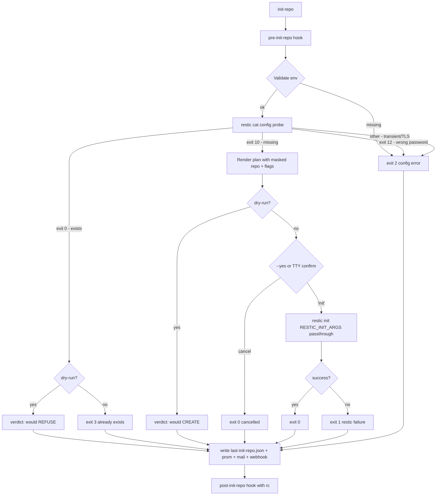

# Init repo

`/bin/init-repo` is the **operator-driven counterpart** to the
entrypoint auto-init probe (`RESTIC_CHECK_REPOSITORY_STATUS`). It
performs an explicit, audited `restic init` with a type-to-confirm
prompt and a `--dry-run` mode that shows exactly what would happen
before any mutation is attempted.

## Why it exists

The container's entrypoint can optionally probe the repository on
startup with `restic cat config` and auto-run `restic init` when the
probe returns exit `10` (repository does not exist). That is
convenient for single-host first runs, but it also means a transient
TLS / DNS / auth failure can occasionally look like exit `10` and
trigger an unwanted re-init on a healthy remote. To eliminate that
risk operators commonly set `RESTIC_CHECK_REPOSITORY_STATUS=OFF`.

With the probe disabled the bootstrap path disappears too. `/bin/init-repo`
fills that gap:

- It runs the same `restic cat config` probe before doing anything
  else, so a healthy existing repo cannot be accidentally re-initialised.
- It distinguishes the four meaningful probe outcomes (`0` = exists,
  `10` = missing, `12` = wrong password, other = transient/auth
  failure) and refuses to call `restic init` unless the probe is a
  clean exit `10`.
- It requires either an interactive TTY plus a typed-word
  confirmation (`init`) or an explicit `--yes`, so a container
  restart can never re-initialise a repository unattended.
- `--dry-run` prints the planned `restic init` command (with the
  masked repository URL and the resolved flag list) and exits **0**
  without touching the remote.

## Quick start

```shell
# Read-only verdict + planned command, no mutation.
docker exec -ti restic-backup-helper /bin/init-repo --dry-run

# Interactive bootstrap. Asks the operator to type 'init'.
docker exec -ti restic-backup-helper /bin/init-repo

# Non-interactive (CI). --yes is required when stdin is not a TTY.
docker run --rm \
  --env-file restic.env \
  -v ./restic.password:/run/secrets/restic_password:ro \
  marc0janssen/restic-backup-helper:latest \
  init-repo --yes

# Pin a specific repository version. Everything after `--` is passed
# verbatim to `restic init`. Same as setting RESTIC_INIT_ARGS in env.
docker exec -ti restic-backup-helper /bin/init-repo --dry-run -- \
  --repository-version=2
```

## Flags

| Flag | Default | Purpose |
| --- | --- | --- |
| `--dry-run` | off | Probe the repository, print the planned command, exit without calling `restic init`. Same audit trail (log, JSON, metrics, mail, webhook, hooks) as a real run so monitoring stays consistent. |
| `--yes`, `-y` | off | Skip the type-to-confirm prompt. Required when stdin is not a TTY; without it the helper aborts with exit `2` to prevent surprise init runs. |
| `--help`, `-h` | – | Print usage and exit. |
| `-- restic-init-flags...` | – | Everything after `--` is appended verbatim to the `restic init` invocation (in addition to `RESTIC_INIT_ARGS`). |

`RESTIC_INIT_ARGS` is the stable env-driven knob, analogous to
`RESTIC_FORGET_ARGS` / `RESTIC_PRUNE_ARGS`. It is whitespace-split
rather than parsed as full shell syntax, so keep values free of spaces
or pass complex cases after `--` from an operator shell. Useful values
include:

- `--repository-version=2` — pin the on-disk format.
- `--copy-chunker-params=/path/to/other_repo` — match the chunker of
  a sibling repository so cross-repository `restic copy` can deduplicate.

## What it does



## Dry-run output

`--dry-run` is the operator-friendly way to answer "what would
happen if I ran this?" before committing. It produces three concrete
artefacts:

1. The probe verdict — exact exit code from `restic cat config`,
   mapped to one of: `repo exists`, `repo missing`, `wrong password`,
   `transient/auth error`.
2. The planned command, with `${word}`-quoted arguments so an
   operator can paste it verbatim into a shell when ready:

   ```text
   Planned command: restic init --repository-version=2
   (Repository URL is read from $RESTIC_REPOSITORY = rclone:jottacloud:backups; not on the command line.)
   ```

3. A one-line verdict at the bottom:

   - `🧪 Dry-run verdict: would CREATE a new restic repository with the plan above.`
   - `🧪 Dry-run verdict: would REFUSE — repository already exists; restic init would fail with 'config file already exists'.`
   - or the matching error when the probe itself reported a problem.

The JSON summary is always written — even in dry-run — so monitoring
stays consistent and you can graph "operator pre-flighted an init"
events alongside the real ones.

## Confirmation prompt

When `--dry-run` is off, the probe reports a missing repo, and
`--yes` is not given, the helper shows:

```text
⚠️  About to CREATE a new restic repository at:
      rclone:jottacloud:backups
    The encryption password will be PERMANENTLY bound to the
    new repository — losing it makes all future backups unrecoverable.

Type 'init' to confirm, anything else to cancel:
```

Anything other than the literal string `init` cancels cleanly with
exit `0` (no mutation, no error metric). Typing `init` proceeds to the
real `restic init`.

When stdin is **not** a TTY and `--yes` was not passed, the helper
refuses to continue and exits with code `2`. This is the safety net
for CI / Kubernetes / Compose restarts that might otherwise pipe an
empty line into the prompt.

## Audit trail

The helper writes:

- `/var/log/init-repo-last.log` — full audit log with the probe
  output, the planned command, the prompt result and the
  `restic init` stdout/stderr.
- `/var/log/init-repo-error-last.log` — copied on failure.
- `/var/log/last-init-repo.json` — see schema below.
- `restic_init_repo.prom` — when `METRICS_DIR` is configured.

Hooks:

```text
/hooks/pre-init-repo.sh                # informational; failure does not abort
/hooks/post-init-repo.sh "$exit_code"  # always called with the helper exit code as $1
```

Mail and webhook notifications use the same `MAILX_*` and `WEBHOOK_*`
settings as the cron-driven workers.

## JSON summary

In addition to the common fields (`job`, `hostname`, `release`,
`started_at`, `finished_at`, `duration_seconds`, `exit_code`):

| Field | Type | Description |
| --- | --- | --- |
| `repository` | string | Masked repository URL. |
| `dry_run` | string | `ON` when `--dry-run` was used, otherwise `OFF`. |
| `assume_yes` | string | `ON` when `--yes` / `-y` was used, otherwise `OFF`. |
| `confirmed` | string | `ON` when the operator typed `init` at the prompt OR when `--yes` was used; `OFF` when the prompt was declined / not reached. |
| `repo_existed` | string | `"true"` / `"false"` / `"unknown"` from the pre-init probe. |
| `probe_exit_code` | string | Raw exit code of `restic cat config`. `-1` when env validation failed before the probe ran. |
| `init_args` | string | The combined `RESTIC_INIT_ARGS` + CLI passthrough flag list (space-joined). |

```json
{
  "job": "init-repo",
  "hostname": "backup-node",
  "release": "2.12.0-0.18.1",
  "started_at": "2026-05-13T16:30:00+0200",
  "finished_at": "2026-05-13T16:30:02+0200",
  "duration_seconds": 2,
  "exit_code": 0,
  "repository": "rclone:jottacloud:backups",
  "dry_run": "ON",
  "assume_yes": "OFF",
  "confirmed": "OFF",
  "repo_existed": "false",
  "probe_exit_code": "10",
  "init_args": "--repository-version=2"
}
```

## Exit codes

| Exit | Meaning |
| --- | --- |
| `0` | Init succeeded, dry-run completed, or operator cancelled at the prompt. |
| `1` | `restic init` returned non-zero (real failure — disk full, write permissions, backend rejection). |
| `2` | Configuration error: missing `RESTIC_REPOSITORY` / `RESTIC_PASSWORD`, no TTY without `--yes`, wrong password reported by the pre-probe, or unexpected probe exit. |
| `3` | Repository already exists; no init attempted. Idempotent: rerun with `--dry-run` for a no-op probe instead. |

## When to use it

- **First container start with `RESTIC_CHECK_REPOSITORY_STATUS=OFF`.**
  The entrypoint will not auto-init; run `/bin/init-repo --dry-run`
  first to confirm the remote is reachable and empty, then re-run
  without `--dry-run` to actually create the repository.
- **Switching to a new repository prefix** (different bucket, new
  rclone remote, fresh subpath). `--dry-run` verifies the new prefix
  is empty and the credentials work before you commit.
- **CI / IaC bootstrap.** `init-repo --yes` is safe inside an
  ephemeral bootstrap job because the probe still guards against
  re-init: if the repo already exists the helper exits `3` without
  mutation.
- **Pinning `--repository-version=2`** or matching a sibling repo's
  `--copy-chunker-params` at create time. Put these in
  `RESTIC_INIT_ARGS` for a stable record, or pass them after `--`.

## When NOT to use it

- **Routine backups.** Init is a one-shot bootstrap; `/bin/backup`
  itself never calls init. After a successful init this helper has
  nothing more to do.
- **As a fix for a "lock exists" or "wrong password" error.** Those
  are handled by [`/bin/unlock`](unlock.md) or your password
  management, respectively. `restic init` cannot recover an existing
  repository.

## See also

- [Lifecycle of a container](../concepts/architecture.md#lifecycle-of-a-container)
  — what the entrypoint does at container startup; this helper is
  its operator-driven counterpart.
- [Unlock](unlock.md) — same operator-driven pattern, for repository
  locks.
- [Sources report](sources-report.md) — pre-flight inventory of the
  paths a backup will read; pair it with `/bin/init-repo --dry-run`
  for a complete first-run sanity check.
- [Environment variables](../configuration/environment-variables.md)
  — `RESTIC_CHECK_REPOSITORY_STATUS`, `RESTIC_INIT_ARGS`,
  `RESTIC_REPOSITORY`, `RESTIC_PASSWORD[_FILE]`.
- [JSON summaries](../reference/json-summaries.md) — schema for
  `last-init-repo.json`.
- [Prometheus metrics](../reference/prometheus-metrics.md) —
  `restic_init_repo_*` gauges.
- [Hooks](../configuration/hooks.md) — `pre-init-repo` /
  `post-init-repo` registration.
